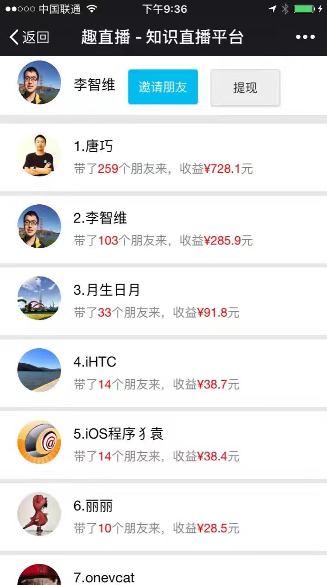

# live-mobile-web

* [live-server](https://github.com/lzwjava/live-server)
* [live-web](https://github.com/lzwjava/live-web)
* [live-mobile-web](https://github.com/lzwjava/live-mobile-web)

<div align="center">


</div>

<div align="center">


</div>

<div align="center">


</div>

### Building

``` bash
npm install
# build:
npm run build
```

